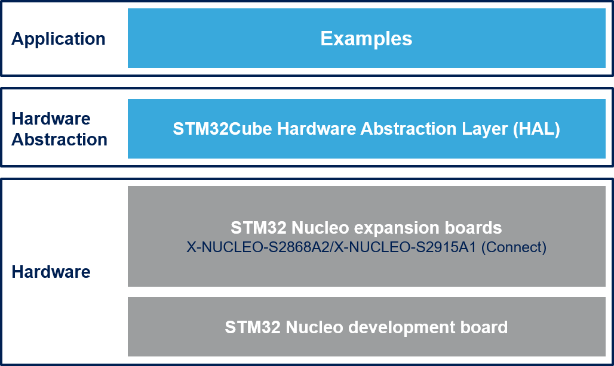

# X-CUBE-SUBG2 Firmware Package

The X-CUBE-SUBG2 software package is an expansion for STM32Cube. This software provides drivers running on STM32 for STM's Radio S2-LP Low data rate and low power sub-1GHz transceiver devices. It is built on top of STM32Cube software technology that ease portability across different STM32 micro-controllers. This Expansion Firmware is built over the X-NUCLEO-S2868A1, X-NUCLEO-S2868A2 or X-NUCLEO-S2915A1 Expansion Board. This Expansion Board can be plugged on the Arduino UNO R3 connectors of any STM32 Nucleo board. The user can mount the ST Morpho connectors if required. The Expansion Board can be easily stacked in order to evaluate different devices with Sub 1GHz communication.

**X-CUBE-SUBG2 software features**:

- Point-to-Point (P2P) communication example to transfer data from one node to another

- 6LoWPAN communication using Contiki-NG middleware. Sample applications include:

  - UDP Client to send messages to a Server
  - UDP Server to receive messages from a Client and to reply back
  - Serial Sniffer to capture RF packets and send them to Wireshark
  - Border Router to connect a 6LoWPAN and a IPv6 networks

- Easy portability across different MCU families thanks to STM32Cube

- Free user-friendly license terms

- Example implementation available on the X-NUCLEO-S2868A1 (868 Mhz), X-NUCLEO-S2868A2 (868 Mhz) or X-NUCLEO-S2915A1 (915 Mhz) STM32 expansion board plugged on top of one NUCLEO-F401RE or NUCLEO-L152RE or NUCLEO-L053R8

This package includes Contiki-NG v4.6 as Third Party Middleware. This
software is provided without modification, this leads to several warnings
in compilation that do not affect the functionality of the firmware.

Here is the list of references to user documents:

- [X-NUCLEO-S2868A1 SCHEMATIC](https://www.st.com/resource/en/schematic_pack/x-nucleo-s2868a1_schematic.pdf)
- [X-NUCLEO-S2868A2 SCHEMATIC](https://www.st.com/resource/en/schematic_pack/x-nucleo-s2868a2_schematic.pdf)
- [X-NUCLEO-S2915A1 SCHEMATIC](https://www.st.com/resource/en/schematic_pack/x-nucleo-s2915a1_schematic.pdf)
- [DS11896 Ultra-low power, high performance, sub-1GHz transceiver](https://www.st.com/resource/en/datasheet/s2-lp.pdf)
- [UM2405 Getting started with the X-NUCLEO-S2868A1 Sub-1 GHz 868 MHz RF expansion board based on S2-LP radio for STM32 Nucleo](https://www.st.com/resource/en/user_manual/dm00498153.pdf)
- [UM2638 Getting started with the X-NUCLEO-S2868A2 Sub-1 GHz 868 MHz RF expansion board based on S2-LP radio for STM32 Nucleo](https://www.st.com/resource/en/user_manual/dm00656126.pdf)
- [UM2641 Getting started with the X-NUCLEO-S2915A1 Sub-1 GHz 915 MHz RF expansion board based on S2-LP radio for STM32 Nucleo](https://www.st.com/resource/en/user_manual/dm00660355.pdf)
